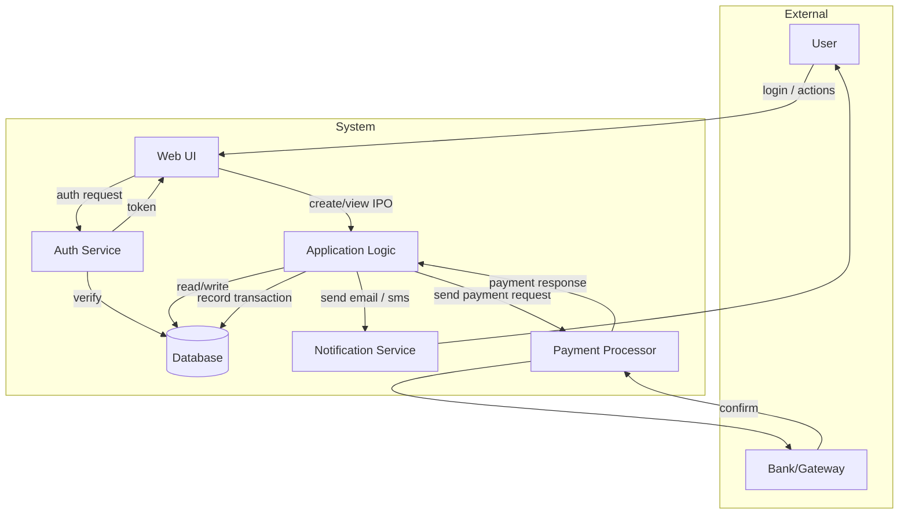

```mermaid
flowchart TD
    subgraph External
      User[User]
      Bank[Bank/Gateway]
    end

    subgraph System
      UI[Web UI]
      Auth[Auth Service]
      App[Application Logic]
      DB[(Database)]
      Notification[Notification Service]
      Payment[Payment Processor]
    end

    User -->|login / actions| UI
    UI -->|auth request| Auth
    Auth -->|verify| DB
    Auth -->|token| UI
    UI -->|create/view IPO| App
    App -->|read/write| DB
    App -->|send payment request| Payment
    Payment -->|payment response| App
    Payment --> Bank
    App -->|record transaction| DB
    App -->|send email / sms| Notification
    Notification --> User
    Bank -->|confirm| Payment
```