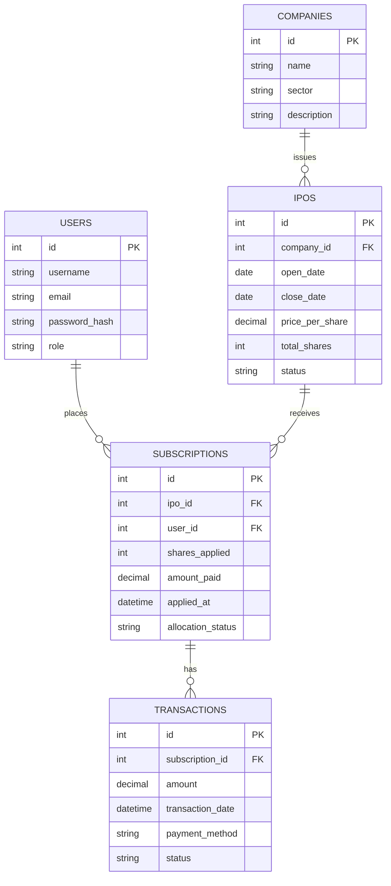

```mermaid
erDiagram
    USERS {
      int id PK
      string username
      string email
      string password_hash
      string role
    }
    COMPANIES {
      int id PK
      string name
      string sector
      string description
    }
    IPOS {
      int id PK
      int company_id FK
      date open_date
      date close_date
      decimal price_per_share
      int total_shares
      string status
    }
    SUBSCRIPTIONS {
      int id PK
      int ipo_id FK
      int user_id FK
      int shares_applied
      decimal amount_paid
      datetime applied_at
      string allocation_status
    }
    TRANSACTIONS {
      int id PK
      int subscription_id FK
      decimal amount
      datetime transaction_date
      string payment_method
      string status
    }

    USERS ||--o{ SUBSCRIPTIONS : places
    COMPANIES ||--o{ IPOS : issues
    IPOS ||--o{ SUBSCRIPTIONS : receives
    SUBSCRIPTIONS ||--o{ TRANSACTIONS : has
```