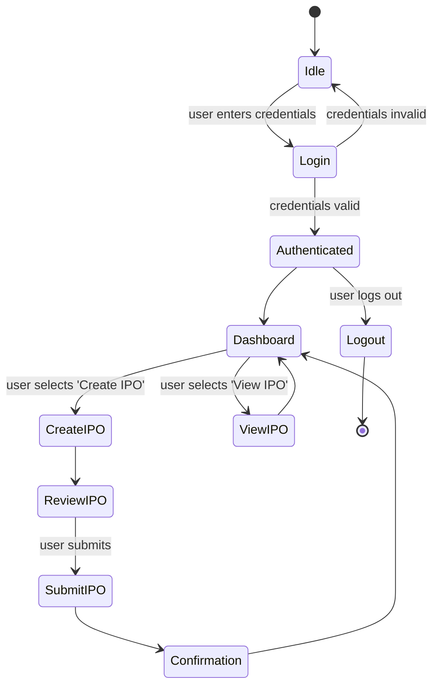

# State Transition Diagram

```mermaid
stateDiagram-v2
    [*] --> Idle
    Idle --> Login : user enters credentials
    Login --> Authenticated : credentials valid
    Login --> Idle : credentials invalid
    Authenticated --> Dashboard
    Dashboard --> CreateIPO : user selects 'Create IPO'
    CreateIPO --> ReviewIPO
    ReviewIPO --> SubmitIPO : user submits
    SubmitIPO --> Confirmation
    Confirmation --> Dashboard
    Dashboard --> ViewIPO : user selects 'View IPO'
    ViewIPO --> Dashboard
    Authenticated --> Logout : user logs out
    Logout --> [*]
```
